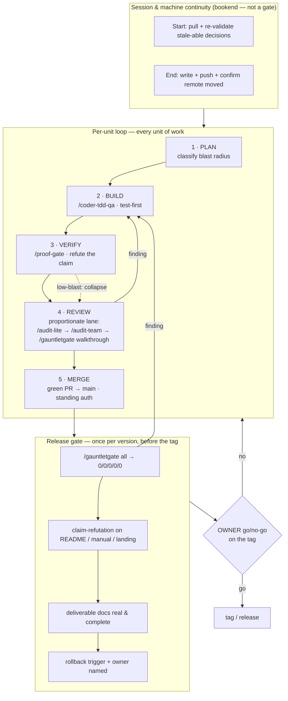
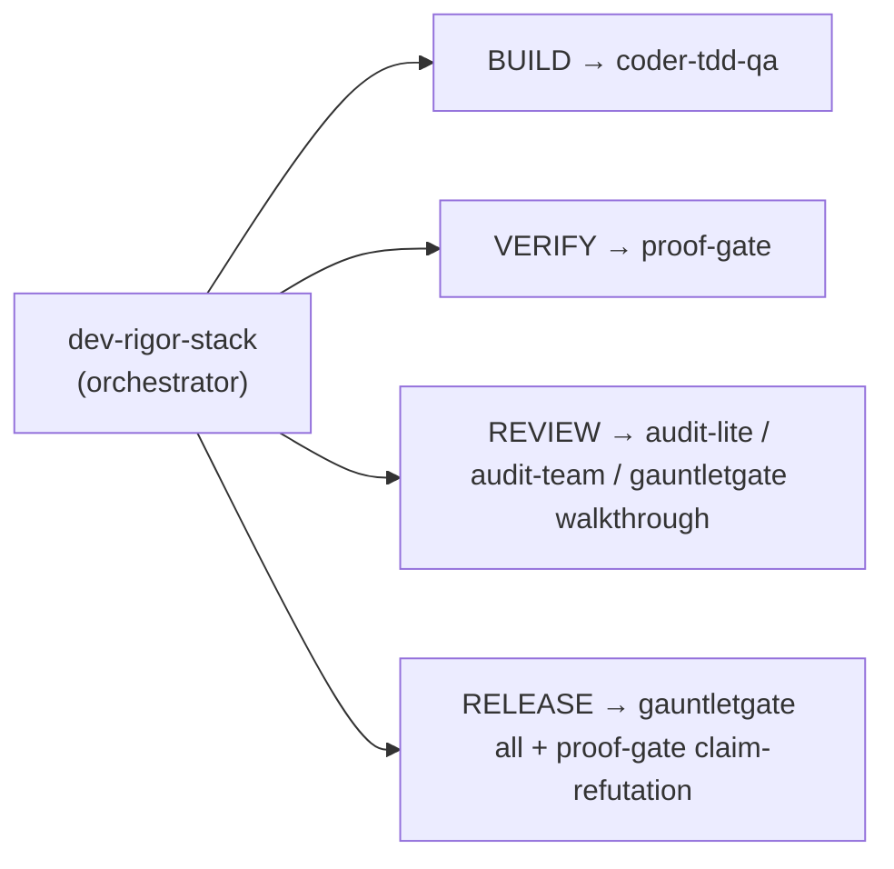

# Architecture

The stack has **two altitudes** and a **continuity bookend**. The per-unit loop runs on
every change; the release gate runs once per version; continuity wraps the whole effort
so nothing durable is lost across sessions or machines.

## Control flow

A red result at any gate returns to the phase that owns it — findings from REVIEW or the
release gauntlet route back into BUILD. Nothing routes *around* a gate.

## Skill composition — which skill serves which gate

The orchestrator holds the discipline; each gate delegates to the skill built for it. The
installer bundles all of these, so a normal install has every lane; if a skill is somehow
absent (a partial or `--target` install), the coordinator runs the equivalent discipline
inline, says so, and still spawns a fresh sub-agent — it never reviews its own work.

`audit-lite`/`audit-team` and `gauntletgate` overlap by design: the same review discipline
in two packagings. The standalone audits are the per-unit *review reports*; gauntletgate is
the release-altitude *advancement gate* whose `lite`/`full` lanes re-run that discipline
self-contained and add a pass/fail verdict. A report vs. a gate.

## The always-on reflex

The skills are pull-based — invoked when the coordinator judges a task needs them. Shipped
alongside is a **reflex**: a one-page distillation of the whole discipline (the proof ladder,
the never-shrink rules, the evidence receipt), injected into every session and every subagent
through a `SessionStart` / `SubagentStart` hook. It makes the discipline present by default
and delegates the heavy mechanics back to the skills above — a convenience layer, not a new
gate. The full text lives in `plugin/dev-rigor-reflex.md`.

## The two roles

- **Coordinator** (the top model / main thread) — plans, classifies blast radius, holds
  the honesty line, gates every merge, and dispatches workers. Decides everything
  reversible, in-spec, and in-sandbox. It **never originates an owner decision**.
- **Owner** (the human) — the one call the coordinator can't make: declaring a release
  real (the tag), and anything irreversible, trust-boundary-crossing, or externally
  valuable. Merging a green-path slice is pre-authorized; tagging is not.

## Fan-out and cost

Heavy or parallel work (test generation across combinations, sweeping for latent
siblings, adversarial verification) fans out to cheaper models through the host's
workflow/orchestration tool — never a bare recursing agent. Each worker states its tier
and moderates its own rigor by it (the fan-out preamble ships in the
[dev-rigor-stack skill](../skills/dev-rigor-stack/SKILL.md)). The coordinator stays lean
and does no grunt work.

## Why "proven," not "green"

The spine of the stack is one rule, inherited from `proof-gate`: **a claim is proven only
by exercising the real artifact through the path a real consumer hits.** A green check is
not proof; a check you've confirmed can go *red* is. Every gate is an application of that
rule at a different scope — a unit, a release, or the verification itself.
